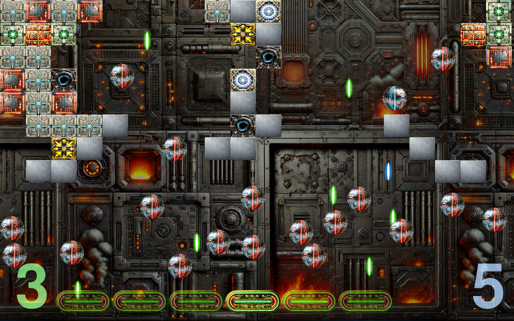
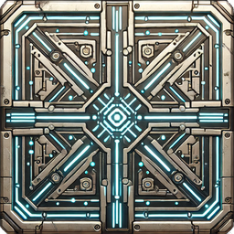
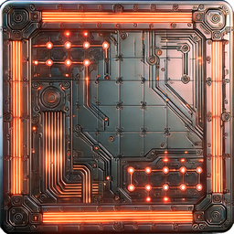
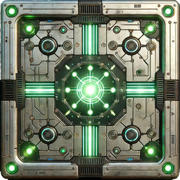
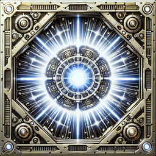
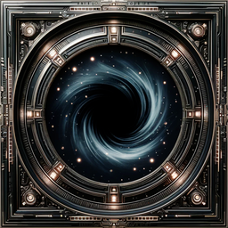
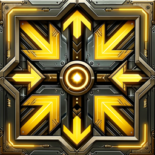
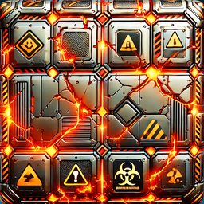
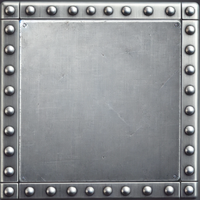
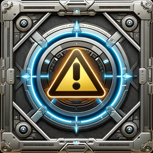

# Breakout

A modern, Pygame-based take on the classic brick-breaker. Clear all destroyable bricks while keeping the blue “hero” ball in play. Power-ups, lasers, inversion, and multi-ball keep things lively.



## Features

- Five handcrafted levels with per-level brick layouts
- Multiple brick types with unique effects and hit points
- Bonus balls, extra bats, control inversion, laser mode, and blackout mode
- Stereo-panned sound effects
- DPI-aware window sizing on Windows, dynamic scaling everywhere
- Smooth intro scene with perspective-warped card and animated balls

## Requirements

- **Python**: 3.10 or newer  
- **OS**: Windows, macOS, or Linux with a working SDL2 video driver

### Python packages

Installed via `pip`:

- `pygame` – rendering, input, audio
- `opencv-python` – intro image warping
- `numpy` – array ops and masks
- `screeninfo` – obtaining primary monitor dimensions

#### Dependencies

```txt
pygame>=2.5
opencv-python>=4.9
screeninfo>=0.8
numpy>=1.24
```

## Installation and Setup

```bash
# 1) Create a virtual environment (recommended)
python -m venv .venv

# 2) Activate the virtual environment
# Windows
.venv\Scripts\activate
# macOS/Linux
source .venv/bin/activate

# 3) Ensure the 'pip' tool is up to date
python -m pip install -U pip

# 4) Install dependencies
pip install pygame opencv-python screeninfo numpy
```

## Running the game

```bash
# 1) Activate the virtual environment (if you haven't already done so)
# Windows
.venv\Scripts\activate
# macOS/Linux
source .venv/bin/activate

# 2) Start the game
python breakout.py
```

## How to play

- **Goal**: Destroy all destroyable bricks in a level without losing all of your lives.
- **Lives**: You lose one life each time the blue hero ball falls off the bottom. Some bricks grant extra lives.
- **Levels**: Clear a level to advance.

### Controls

- **Mouse**: Move the bat horizontally
- **Space**: Pause or resume
- **Q / Esc**: Quit
- **Intro screen**: Move the mouse over the menu to select a difficulty, then click or press any key

### Brick types

| Brick | Type | Description |
|-------|-------|-------------|
|  | **Blue** | Standard; no effect |
|  | **Red** | Spawns a temporary red bonus ball |
|  | **Green** | Adds a temporary extra bat |
|  | **White star** | Grants an extra life |
|  | **Black hole** | Temporarily darkens the screen |
|  | **Yellow arrows** | Temporarily reverse controls |
|  | **Cracked fire** | Destroys neighbouring bricks (cascade) |
|  | **Metal** | Indestructible |
|  | **Warning triangle** | Enables laser mode for a duration |

Different brick types require different numbers of hits to destroy.

## Troubleshooting

- **No video device / SDL errors (Linux)**: Ensure you are in a graphical session and SDL2 can open a display. On headless systems set up Xvfb or Wayland appropriately.
- **OpenCV import errors**: Use `opencv-python` wheels rather than `opencv`. On some Linux distros you may need system OpenGL packages.
- **Fonts missing**: The code uses the default Pygame font; if you change it (e.g. to a system font), ensure it is installed.
- **DPI scaling quirks (Windows)**: The game queries monitor DPI in a subprocess. Ensure `python` is on PATH and `dpi_subproc.py` is accessible next to your main script.

## Credits

- Pygame community (https://www.pygame.org/contribute.html) for an excellent Python module
- The very useful sfxr (https://sfxr.me/) for sound effect generation
- A nod to Arkanoid, Fireball 2 (Archimedes), and other classics
- Thanks to ChatGPT for art assistance

---

_Dedicated to Helena and Karen._
